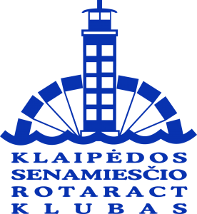

Inkilėlius galite įsigyti iki balandžio 23 dienos.

Parašykite mums žinutę, kad norite inkilėlio ir mes jį Jums rezervuosime. Inkilėlio kaina – 15 Eur, įmonėms – 30 eur.

<table>
<tbody>
  <tr>
    <td colspan="3"><b>VILNIUJE</b></td>
  </tr>
  <tr>
    <td>Jei norite įsigyti inkilėlį, kuris kabės Vilniuje, susisiekite el.p. vilnius@sekmesinkilelis.lt, 8 687 83493. Laiške nurodykite savininko vardą.</td>
    <td rowspan="2"></td>
  </tr>
  <tr>
    <td>Asociacija „Vilniaus Geležinio Vilko Rotaract klubas”  
A/S: LT84 7300 0101 4243 9552 AB “Swedbank” 
Paskirtis – Sėkmės inkilėlis (savininko vardas ir pavardė)</td>
  </tr>
  <tr>
    <td colspan="3"><b>ŠIAULIUOSE</b></td>
  </tr>
  <tr>
    <td>Jei norite įsigyti inkilėlį, kuris kabės Šiauliuose, susisiekite el.p. siauliai@sekmesinkilelis.lt, 8 673 46403. Laiške nurodykite savininko vardą.</td>
    <td rowspan="2"></td>
  </tr>
  <tr>
    <td>Asociacija „Šiaulių Auksinio Rato Rotaract klubas“ 
A/S: LT947180000001700070 AB “Šiaulių bankas” 
Paskirtis – Sėkmės inkilėlis (savininko vardas ir pavardė)</td>
  </tr>
  <tr>
    <td colspan="3"><b>KAUNE</b></td>
  </tr>
  <tr>
    <td>Jei norite įsigyti inkilėlį, kuris kabės Kaune, susisiekite el.p. kaunas@sekmesinkilelis.lt, 8 613 99913. Laiške nurodykite savininko vardą.</td>
    <td rowspan="2"></td>
  </tr>
  <tr>
    <td>Asociacija „Kauno Tvirtovės Rotaract klubas“  
A/S: LT374010051001794230, DnB Bankas  
Paskirtis – Sėkmės inkilėlis (savininko vardas ir pavardė)</td>
  </tr>
  <tr>
    <td colspan="3"><b>KLAIPĖDOJE</b></td>
  </tr>
  <tr>
    <td>Jei norite įsigyti inkilėlį, kuris kabės Klaipėdoje, susisiekite el.p. klaipeda@sekmesinkilelis.lt, 8 653 30601. Laiške nurodykite savininko vardą.</td>
    <td rowspan="2"></td>
  </tr>
  <tr>
    <td>Asociacija „Klaipėdos Senamiesčio Rotaract klubas“  
A/S: LT987044060000585281, SEB bankas 
Paskirtis – Sėkmės inkilėlis (savininko vardas ir pavardė)
  </tr>
</tbody>
</table> 
