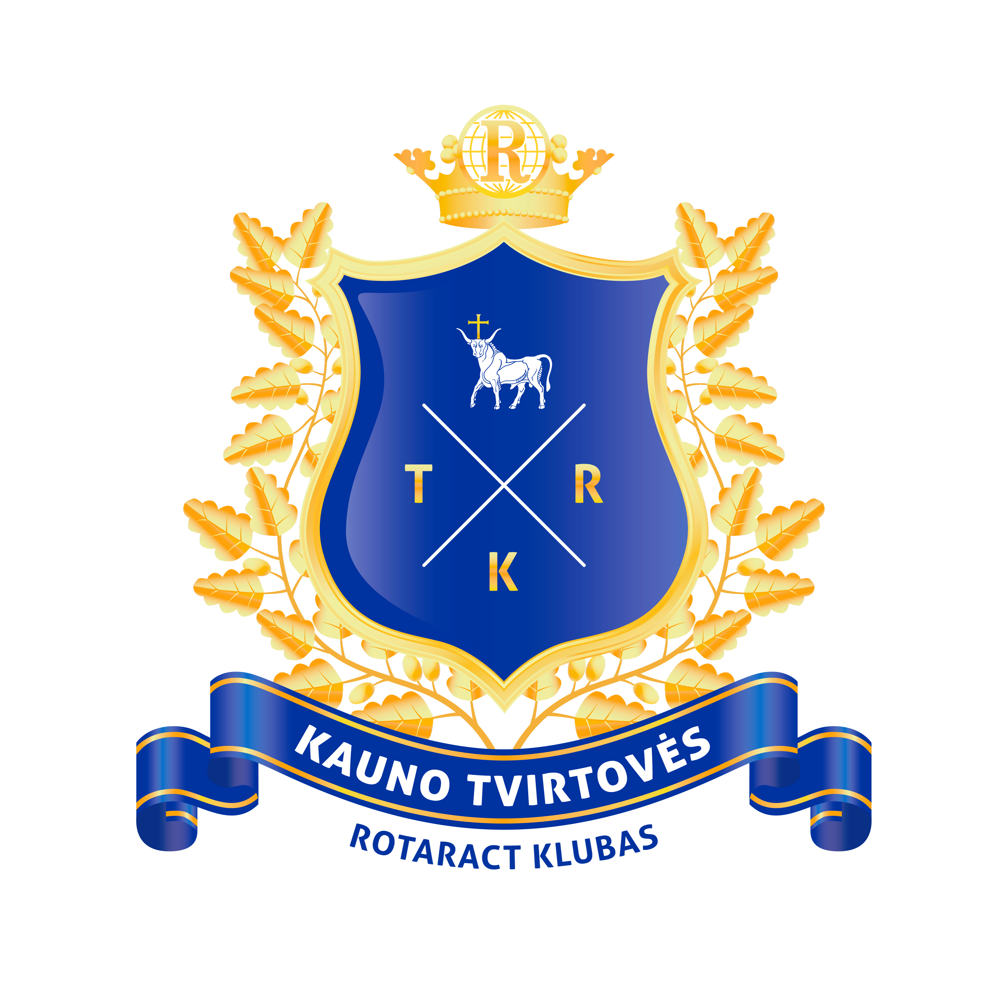

<table>
<tbody>
  <tr>
    <td colspan="3"><b>VILNIUJE</b></td>
  </tr>
  <tr>
    <td>Asociacija „Vilniaus Geležinio Vilko Rotaract klubas”  
A/S: LT84 7300 0101 4243 9552 AB “Swedbank”  
el.p. vilnius@sekmesinkilelis.lt  
8 687 83493</td>
    <td rowspan="1"></td>
  </tr>
  <tr>
    <td colspan="3"><b>ŠIAULIUOSE</b></td>
  </tr>
  <tr>
    <td>Asociacija „Šiaulių Auksinio Rato Rotaract klubas“ 
A/S: LT947180000001700070 AB “Šiaulių bankas” 
el.p. siauliai@sekmesinkilelis.lt  
 8 673 46403</td>
    <td rowspan="1"></td>
  </tr>
  <tr>
    <td colspan="3"><b>KAUNE</b></td>
  </tr>
  <tr>
    <td>Asociacija „Kauno Tvirtovės Rotaract klubas“  
A/S: LT374010051001794230, DnB Bankas  
el.p. kaunas@sekmesinkilelis.lt  
 8 613 99913</td>
    <td rowspan="1"></td>
  </tr>
  <tr>
    <td colspan="3"><b>KLAIPĖDOJE</b></td>
  </tr>
  <tr>
    <td>Asociacija „Klaipėdos Senamiesčio Rotaract klubas“  
A/S: LT987044060000585281, SEB bankas   
el.p. klaipeda@sekmesinkilelis.lt  
 8 653 30601</td>
    <td rowspan="1"></td>
  </tr>
</tbody>
</table> 
